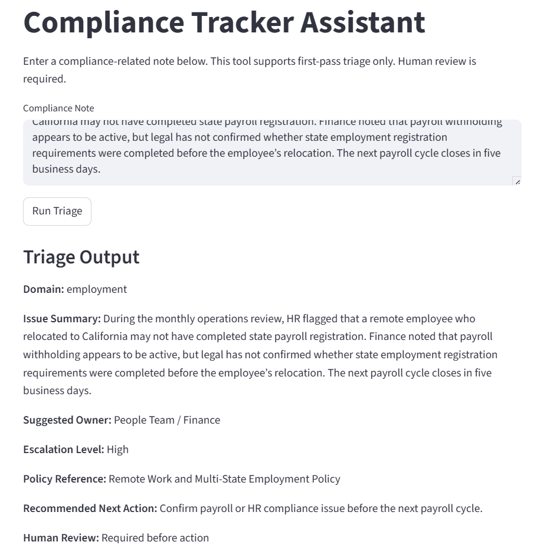
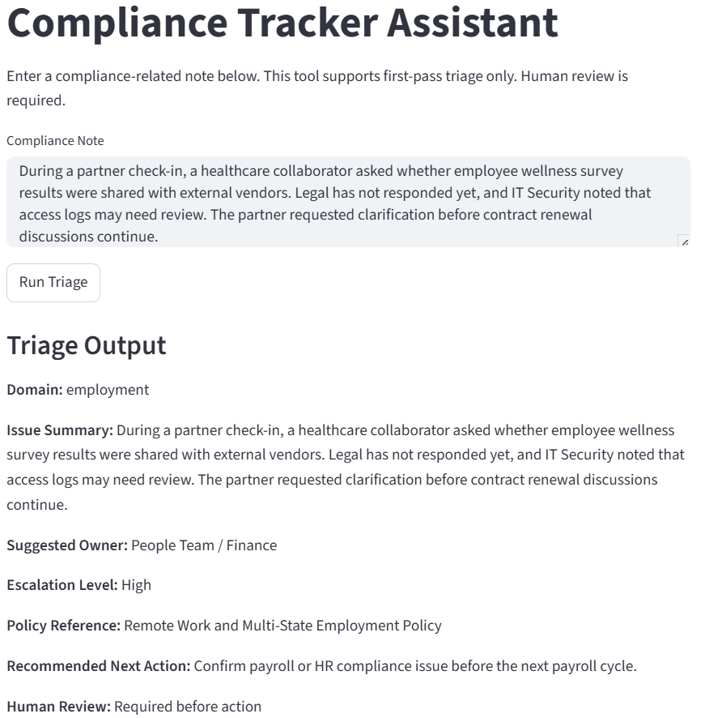
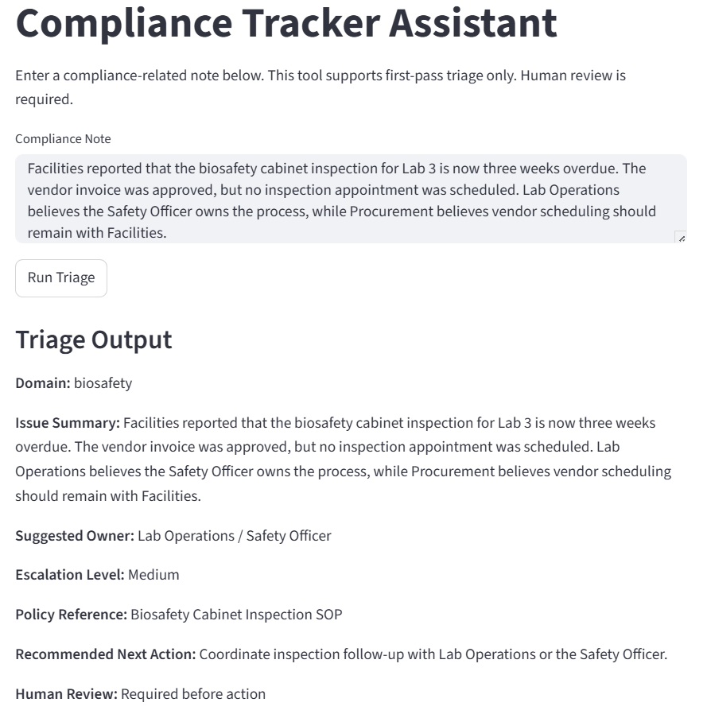
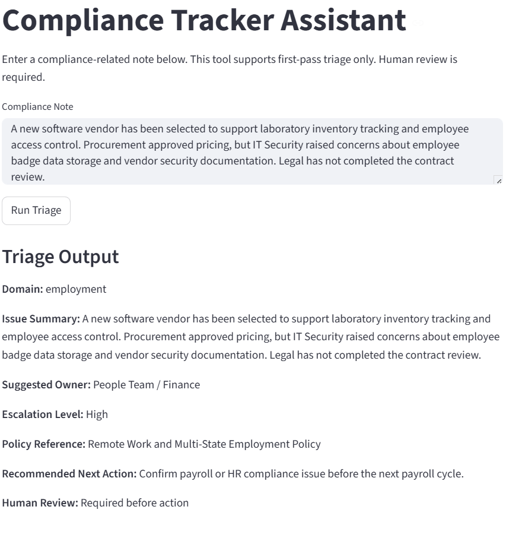
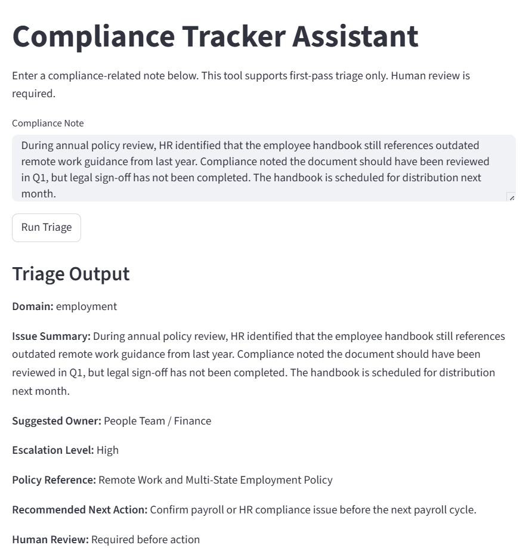

# Compliance Tracker Assistant

## Context, User, and Problem

This project supports a compliance coordinator, project coordinator, or operations manager working in regulated industries such as biotechnology, healthcare, life sciences, or other compliance-driven environments.

Compliance issues often surface through internal meeting notes, audit findings, HR discussions, legal reviews, vendor escalations, or operational conversations.

A coordinator may need to:

- identify the compliance domain
- determine the correct owner
- locate relevant policy or SOP references
- assign escalation priority
- create tracker-ready follow-up actions

This process is often manual, inconsistent, and dependent on tribal knowledge. Missed ownership or delayed escalation can create operational risk, audit findings, or regulatory exposure.

---

## Solution and Design

I built a Streamlit application that converts one unstructured compliance note into a structured triage output.

The tool returns:

- Domain
- Issue Summary
- Suggested Owner
- Escalation Level
- Policy Reference
- Recommended Next Action
- Human Review Requirement

The application uses Claude through the Anthropic API to interpret the compliance note and classify it into one of the supported compliance domains.

The project also uses deterministic lookup files:

- `owners.json` routes each compliance domain to a suggested owner
- `policies.json` maps each domain to a policy reference
- `app.py` provides the Streamlit user interface, Claude API call, and triage logic

This design separates GenAI interpretation from controlled business routing logic.

Claude interprets messy natural language, while owner and policy routing remain controlled through registry files to reduce hallucination risk and improve auditability.

---

## Why GenAI Is Useful

Compliance notes are often written in natural language and may include:

- incomplete ownership details
- multiple stakeholders
- ambiguous escalation signals
- inconsistent formatting
- operational context mixed with compliance risk

Traditional rule-based systems struggle with this variability.

GenAI improves this workflow by:

- interpreting messy or incomplete language
- classifying issues based on context
- supporting consistent first-pass triage
- improving structured documentation quality

However, GenAI is only used for interpretation.

Ownership, policy references, and escalation logic remain under deterministic business controls.

---

## Baseline Comparison

The baseline represents how this work is often done today.

A coordinator manually:

1. reads the compliance note
2. identifies the compliance domain
3. checks spreadsheets or internal trackers
4. finds the correct owner
5. searches for policy references
6. drafts a follow-up action

Common baseline issues include:

- inconsistent outputs
- missing ownership
- unclear escalation
- reliance on tribal knowledge
- missed documentation gaps

The Compliance Tracker Assistant improves the baseline by producing consistent, structured, and tracker-ready outputs.

---

## Setup Instructions

### 1. Clone or download this repository.

### 2. Install dependencies:

```bash
py -m pip install -r requirements.txt
```

### 3. Create a `.env` file in the project root folder.

Add your Anthropic API key:

```text
ANTHROPIC_API_KEY=your_api_key_here
```

### 4. Run the Streamlit application:

```bash
py -m streamlit run app.py
```

### 5. Open the local browser link provided by Streamlit.

---

## Example Input

```text
During the monthly operations review, HR flagged that a remote employee who relocated to California may not have completed state payroll registration. Finance noted that payroll withholding appears to be active, but legal has not confirmed whether state employment registration requirements were completed before the employee’s relocation.
```

---

## Example Output

```text
Domain: employment

Issue Summary:
During the monthly operations review, HR flagged that a remote employee who relocated to California may not have completed state payroll registration....

Suggested Owner:
People Team / Finance

Escalation Level:
High

Policy Reference:
Remote Work and Multi-State Employment Policy

Recommended Next Action:
Confirm payroll or HR compliance issue before the next payroll cycle.

Human Review:
Required before action
```

---

## Evaluation and Results

The project includes a synthetic evaluation set in `sample_inputs.md`.

The evaluation covers:

- Employment compliance
- Biosafety
- Data privacy
- Contract review
- Policy governance
- Ambiguous inputs
- Multi-domain scenarios
- High-risk escalation cases

Evaluation criteria include:

- Domain classification accuracy
- Owner routing accuracy
- Policy reference relevance
- Escalation appropriateness
- Output completeness
- Safe handling of ambiguity

Detailed evaluation results are documented in `evaluation.md`.

---

## Human Oversight and Limitations

This tool does not provide legal advice.

This tool does not make final compliance decisions.

All outputs require human review before action is taken.

Current limitations include:

- Multi-domain notes may require multiple owner assignments
- Some highly ambiguous notes may require manual clarification
- Policy references are synthetic and not connected to a live enterprise knowledge base
- Escalation logic currently uses controlled business rules
- The tool supports first-pass triage only

---

## Artifact Snapshot

The working artifact is a Streamlit application implemented in `app.py`.

A user can:

1. enter an unstructured compliance note
2. click **Run Triage**
3. receive a structured tracker-ready compliance output

This demonstrates a practical GenAI workflow that combines Claude-based language interpretation with deterministic business controls.

---

## Initial Model Testing

During real testing, Claude was evaluated across multiple enterprise compliance scenarios.

Initial testing revealed strong performance in some domains, but also showed classification drift in several edge cases. This led to prompt refinement and improved domain-specific instructions.

### Employment Compliance Case



### Privacy Escalation Case (Initial Misclassification)



### Biosafety Operations Case



### Vendor Risk Case (Initial Misclassification)



### Policy Governance Case (Initial Misclassification)

